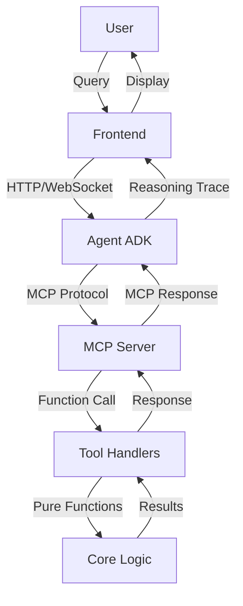

# Design Document: Travel Genie Improvements

## Overview

This design enhances the Travel Genie AI Travel Recommendation System with improved agent reasoning, proper MCP-based tool integration, sophisticated scoring algorithms, and enhanced user experience. The improvements maintain the existing architectural separation between core logic, tools, and agent coordination while introducing better abstractions and more explicit reasoning capabilities.

The key improvements are:

1. **Explicit epistemic reflection** - Agent demonstrates what it knows and doesn't know
2. **MCP protocol integration** - Tools communicate via MCP client/server instead of direct imports
3. **Holistic scoring** - Multi-factor scoring with weighted trade-offs
4. **Enhanced synthesis** - Richer explanations with explicit reasoning
5. **Improved frontend** - Visual representation of agent reasoning and decision process

## Architecture

### Current Architecture

```
User Query → Agent (ADK) → Tool Functions (wrapped) → Core Logic → Results
```

### Improved Architecture

```
User Query → Agent (ADK) → MCP Client → MCP Server → Tool Handlers → Core Logic → Results
                ↓                                                              ↓
          Frontend (React) ←─────────────────────────────────────────────────┘
```

### Key Architectural Changes

1. **MCP Integration Layer**: Replace direct function imports with MCP client/server communication
2. **Enhanced Agent Instructions**: Add explicit epistemic reflection prompts
3. **Unified Scoring Module**: Consolidate scoring logic with multi-factor weighting
4. **Reasoning Trace**: Capture and expose agent reasoning steps for frontend display
5. **Profile Management API**: Add endpoints for profile CRUD operations

### Component Interactions



## Components and Interfaces

### 1. MCP Client Integration

**Location**: `agent/mcp_client.py`

**Purpose**: Provide MCP protocol client for agent to call tools

**Interface**:

```python
class MCPClient:
    def __init__(self, server_url: str):
        """Initialize MCP client with server URL."""

    async def call_tool(self, tool_name: str, arguments: dict) -> dict:
        """Call a tool via MCP protocol.

        Args:
            tool_name: Name of the tool to call
            arguments: Tool arguments as dictionary

        Returns:
            Tool response as dictionary

        Raises:
            MCPConnectionError: If server is unreachable
            MCPToolError: If tool execution fails
        """

    async def list_tools(self) -> list[dict]:
        """List available tools from server."""

    async def close(self):
        """Close client connection."""
```

**Key Design Decisions**:

- Async interface for non-blocking tool calls
- Explicit error types for connection vs execution failures
- JSON serialization for all requests/responses
- Connection pooling for performance

### 2. Enhanced Agent Coordinator

**Location**: `agent/coordinator.py` (modified)

**Purpose**: Orchestrate reasoning with explicit epistemic reflection

**Changes**:

```python
# Add epistemic reflection stage
EPISTEMIC_REFLECTION_PROMPT = """
Before answering, explicitly identify what information you need:
1. What do you know from the user's question?
2. What is missing or underspecified?
3. Why is each missing piece necessary?
4. What will you do to gather this information?

State your reflection clearly before taking any action.
"""

# Replace direct imports with MCP client calls
class EnhancedCoordinator:
    def __init__(self, mcp_client: MCPClient):
        self.mcp_client = mcp_client
        self.reasoning_trace = []

    async def call_tool_with_trace(self, tool_name: str, args: dict) -> dict:
        """Call tool and record in reasoning trace."""
        self.reasoning_trace.append({
            "stage": "tool_call",
            "tool": tool_name,
            "arguments": args,
            "timestamp": datetime.now()
        })
        result = await self.mcp_client.call_tool(tool_name, args)
        self.reasoning_trace.append({
            "stage": "tool_response",
            "tool": tool_name,
            "result": result,
            "timestamp": datetime.now()
        })
        return result
```

**Key Design Decisions**:

- Reasoning trace captures all agent actions
- Epistemic reflection is explicit in prompts
- MCP client injected as dependency
- Async/await for tool calls

### 3. Unified Scoring Module

**Location**: `core/scoring.py` (enhanced)

**Purpose**: Provide holistic multi-factor scoring with weighted trade-offs

**Interface**:

```python
@dataclass
class ScoringWeights:
    """Weights for different scoring factors."""
    weather: float = 0.3
    price: float = 0.3
    schedule: float = 0.2
    comfort: float = 0.2

    def normalize(self) -> 'ScoringWeights':
        """Ensure weights sum to 1.0."""

@dataclass
class FactorScore:
    """Score for a single factor."""
    factor_name: str
    raw_score: float  # 0.0 to 1.0
    weight: float
    weighted_score: float
    explanation: str

@dataclass
class HolisticScore:
    """Complete score with all factors."""
    total_score: float  # 0.0 to 1.0
    factor_scores: list[FactorScore]

    def get_explanation(self) -> str:
        """Generate human-readable explanation."""

def score_travel_option(
    weather: WeatherPeriod,
    flight: FlightOption,
    hotel: HotelOption,
    profile: UserProfile,
    weights: Optional[ScoringWeights] = None
) -> HolisticScore:
    """Score a complete travel option holistically.

    Args:
        weather: Weather conditions for the period
        flight: Flight option
        hotel: Hotel option
        profile: User preferences
        weights: Custom scoring weights (optional)

    Returns:
        Holistic score with factor breakdown
    """
```

**Scoring Algorithm**:

1. **Weather Score** (0.0 to 1.0):
   - Temperature match: `1.0 - abs(avg_temp - preferred_temp) / temp_tolerance`
   - Storm penalty: `0.0` if severe storm and safety_conscious, else `1.0 - storm_severity * 0.3`
   - Combined: `temp_score * storm_score`

2. **Price Score** (0.0 to 1.0):
   - Flight: `1.0` if under soft budget, `0.5` if under hard budget, `0.0` if over hard budget
   - Hotel: `1.0 - abs(rate - preferred_rate) / budget_range`
   - Combined: `(flight_score + hotel_score) / 2`

3. **Schedule Score** (0.0 to 1.0):
   - Flexibility bonus: `+0.2` for weekday, `+0.1` for red-eye
   - Duration penalty: `-0.1` per layover, `-0.05` per hour over 8 hours
   - Normalized to 0.0-1.0 range

4. **Comfort Score** (0.0 to 1.0):
   - Brand match: `+0.3` if preferred brand
   - Hotel rating: `rating / 5.0`
   - Anomaly penalty: `-0.2` if anomalous pricing and safety_conscious
   - Combined and normalized

5. **Total Score**:
   ```
   total = Σ(factor_score * weight) for all factors
   ```

**Key Design Decisions**:

- All factor scores normalized to 0.0-1.0
- Weights are configurable and sum to 1.0
- Each factor provides explanation text
- Monotonic with respect to user preferences

### 4. Enhanced Weather Analysis

**Location**: `core/analysis.py` (enhanced)

**Purpose**: Sophisticated temperature matching and storm risk assessment

**Interface**:

```python
def analyze_weather_match(
    forecast: WeatherForecast,
    profile: UserProfile
) -> list[WeatherMatchResult]:
    """Analyze weather forecast against user preferences.

    Args:
        forecast: Weather forecast with periods
        profile: User preferences including temperature range

    Returns:
        List of match results, one per period, sorted by match quality
    """

@dataclass
class WeatherMatchResult:
    """Result of weather analysis for a period."""
    period: WeatherPeriod
    temperature_score: float  # 0.0 to 1.0
    storm_risk_score: float  # 0.0 to 1.0
    overall_score: float  # Combined score
    explanation: str
    is_optimal: bool  # True if this is an optimal window
```

**Temperature Matching Algorithm**:

```python
def calculate_temperature_score(
    avg_temp: float,
    preferred_range: tuple[float, float],
    tolerance: float = 5.0
) -> float:
    """Calculate temperature match score.

    Returns 1.0 if within preferred range,
    decreases linearly with distance outside range.
    """
    min_pref, max_pref = preferred_range

    if min_pref <= avg_temp <= max_pref:
        return 1.0

    if avg_temp < min_pref:
        deviation = min_pref - avg_temp
    else:
        deviation = avg_temp - max_pref

    # Linear decay with tolerance
    score = max(0.0, 1.0 - (deviation / tolerance))
    return score
```

**Storm Risk Assessment**:

```python
def calculate_storm_risk_score(
    storm_risk: bool,
    storm_severity: Optional[str],
    safety_conscious: bool
) -> float:
    """Calculate storm risk score.

    Returns 1.0 if no storm risk,
    decreases based on severity and user safety preference.
    """
    if not storm_risk:
        return 1.0

    severity_penalties = {
        "minor": 0.1,
        "moderate": 0.3,
        "severe": 0.7
    }

    penalty = severity_penalties.get(storm_severity, 0.5)

    if safety_conscious:
        penalty *= 1.5  # Amplify penalty for safety-conscious users

    return max(0.0, 1.0 - penalty)
```

### 5. Advanced Flight Scoring

**Location**: `core/scoring.py` (enhanced)

**Purpose**: Properly weigh schedule flexibility and budget constraints

**Interface**:

```python
def score_flight(
    flight: FlightOption,
    profile: UserProfile
) -> FactorScore:
    """Score a flight option against user preferences.

    Considers:
    - Price vs soft/hard budget
    - Schedule flexibility (weekday, red-eye)
    - Duration and layovers
    - Airline preferences (if any)
    """

def calculate_flight_price_score(
    price: float,
    soft_budget: float,
    hard_budget: float
) -> tuple[float, str]:
    """Calculate price score with graduated penalties.

    Returns:
        (score, explanation) tuple
        - 1.0 if under soft budget
        - 0.5-0.9 if between soft and hard budget (graduated)
        - 0.0 if over hard budget
    """
    if price <= soft_budget:
        return 1.0, f"Within preferred budget (${price:.0f} ≤ ${soft_budget:.0f})"

    if price <= hard_budget:
        # Graduated penalty between soft and hard
        range_size = hard_budget - soft_budget
        overage = price - soft_budget
        penalty = (overage / range_size) * 0.5  # Max 0.5 penalty
        score = 1.0 - penalty
        return score, f"Above preferred but within limit (${price:.0f}, ${soft_budget:.0f}-${hard_budget:.0f})"

    return 0.0, f"Exceeds budget limit (${price:.0f} > ${hard_budget:.0f})"

def calculate_schedule_flexibility_score(
    flight: FlightOption,
    profile: UserProfile
) -> tuple[float, str]:
    """Calculate score bonus for schedule flexibility.

    Rewards:
    - Weekday flights (+0.2)
    - Red-eye flights (+0.1)
    - Flexible users get full bonus
    - Inflexible users get reduced bonus
    """
    base_score = 0.7  # Baseline
    bonus = 0.0
    reasons = []

    if flight.is_weekday:
        weekday_bonus = 0.2 * (profile.flexibility_days / 7.0)
        bonus += weekday_bonus
        reasons.append(f"weekday (+{weekday_bonus:.2f})")

    if flight.is_red_eye:
        redeye_bonus = 0.1 * (profile.flexibility_days / 7.0)
        bonus += redeye_bonus
        reasons.append(f"red-eye (+{redeye_bonus:.2f})")

    score = min(1.0, base_score + bonus)
    explanation = f"Schedule flexibility: {', '.join(reasons)}" if reasons else "Standard schedule"

    return score, explanation
```

### 6. Nuanced Hotel Scoring

**Location**: `core/scoring.py` (enhanced)

**Purpose**: Recognize trade-offs between price, comfort, and risk

**Interface**:

```python
def score_hotel(
    hotel: HotelOption,
    profile: UserProfile
) -> FactorScore:
    """Score a hotel option against user preferences.

    Considers:
    - Price vs budget range
    - Brand loyalty
    - Rating vs comfort level
    - Anomalous pricing and associated risks
    """

def calculate_hotel_price_score(
    nightly_rate: float,
    budget_min: float,
    budget_max: float
) -> tuple[float, str]:
    """Calculate hotel price score.

    Returns 1.0 if within budget range,
    decreases linearly outside range.
    """
    if budget_min <= nightly_rate <= budget_max:
        # Within range - score based on position
        range_size = budget_max - budget_min
        position = (nightly_rate - budget_min) / range_size
        # Prefer middle of range
        score = 1.0 - abs(0.5 - position) * 0.2
        return score, f"Within budget range (${nightly_rate:.0f}, ${budget_min:.0f}-${budget_max:.0f})"

    if nightly_rate < budget_min:
        # Below minimum - might be too basic
        deviation = budget_min - nightly_rate
        penalty = min(0.3, deviation / budget_min)
        score = 1.0 - penalty
        return score, f"Below preferred range (${nightly_rate:.0f} < ${budget_min:.0f})"

    # Above maximum
    deviation = nightly_rate - budget_max
    penalty = min(1.0, deviation / budget_max)
    score = 1.0 - penalty
    return score, f"Above budget range (${nightly_rate:.0f} > ${budget_max:.0f})"

def calculate_anomaly_impact(
    hotel: HotelOption,
    profile: UserProfile
) -> tuple[float, str]:
    """Calculate impact of anomalous pricing.

    Anomalous pricing (e.g., storm discounts) creates trade-offs:
    - Price benefit vs safety risk
    - Weighted by user safety consciousness
    """
    if not hotel.is_anomalous_pricing:
        return 0.0, "Normal pricing"

    # Anomalous pricing is a red flag for safety-conscious users
    if profile.safety_conscious:
        penalty = 0.3
        return -penalty, f"Anomalous pricing ({hotel.anomalous_reason}) - safety concern"

    # For non-safety-conscious users, it's a potential benefit
    bonus = 0.1
    return bonus, f"Anomalous pricing ({hotel.anomalous_reason}) - potential deal"
```

### 7. Enhanced Synthesis

**Location**: `agent/coordinator.py` (modified)

**Purpose**: Generate nuanced explanations with explicit reasoning

**Changes**:

```python
SYNTHESIS_PROMPT = """
Generate a comprehensive recommendation that includes:

1. PRIMARY RECOMMENDATION:
   - Recommended dates (start and end)
   - Overall assessment (1-2 sentences)

2. FACTOR-BY-FACTOR REASONING:
   For each factor (weather, price, schedule, comfort), explain:
   - What the data shows
   - How it aligns with user preferences
   - What trade-offs were made (if any)

3. ALTERNATIVES (1-2 options):
   For each alternative:
   - Dates
   - Key difference from primary recommendation
   - Why it might be preferred by some users

4. REJECTED PERIODS:
   For each rejected period:
   - Dates
   - Specific reason for rejection
   - What would need to change for it to be viable

5. TRADE-OFF ACKNOWLEDGMENT:
   - Explicitly state any trade-offs in the primary recommendation
   - Explain how they were resolved based on user priorities

Use clear, human-readable language. Avoid technical jargon.
Be specific with numbers and dates.
"""
```

**Synthesis Data Structure**:

```python
@dataclass
class EnhancedRecommendation:
    """Enhanced recommendation with detailed reasoning."""
    primary: RecommendationOption
    alternatives: list[RecommendationOption]
    rejected: list[RejectedOption]
    trade_offs: list[TradeOffExplanation]
    reasoning_trace: list[ReasoningStep]

@dataclass
class RecommendationOption:
    """A single recommendation option."""
    start_date: date
    end_date: date
    overall_score: float
    factor_explanations: dict[str, str]  # factor -> explanation
    summary: str

@dataclass
class RejectedOption:
    """A rejected time period with explanation."""
    start_date: date
    end_date: date
    rejection_reason: str
    what_would_fix: str

@dataclass
class TradeOffExplanation:
    """Explanation of a trade-off."""
    factor_a: str
    factor_b: str
    resolution: str
    user_priority: str
```

### 8. Frontend Reasoning Display

**Location**: `frontend/src/components/ReasoningDisplay.tsx`

**Purpose**: Visual representation of agent's decision process

**Component Structure**:

```typescript
interface ReasoningStep {
  stage: 'epistemic_reflection' | 'tool_call' | 'tool_response' | 'reasoning' | 'synthesis';
  timestamp: string;
  content: any;
}

interface ReasoningDisplayProps {
  steps: ReasoningStep[];
  currentStep?: number;
}

export const ReasoningDisplay: React.FC<ReasoningDisplayProps> = ({ steps, currentStep }) => {
  return (
    <div className="reasoning-timeline">
      {steps.map((step, index) => (
        <ReasoningStepCard
          key={index}
          step={step}
          isActive={index === currentStep}
          isComplete={index < (currentStep || steps.length)}
        />
      ))}
    </div>
  );
};
```

**Visual Design**:

- Timeline view with stages connected by lines
- Each stage shows: icon, title, timestamp, summary
- Expandable details for tool calls and responses
- Color coding: blue (in progress), green (complete), gray (pending)
- Smooth animations between stages

### 9. Alternatives and Rejected Periods Display

**Location**: `frontend/src/components/OptionsDisplay.tsx`

**Purpose**: Present alternatives and rejected periods clearly

**Component Structure**:

```typescript
interface OptionsDisplayProps {
  primary: RecommendationOption;
  alternatives: RecommendationOption[];
  rejected: RejectedOption[];
}

export const OptionsDisplay: React.FC<OptionsDisplayProps> = ({
  primary,
  alternatives,
  rejected
}) => {
  return (
    <div className="options-container">
      <PrimaryRecommendation option={primary} />

      <AlternativesSection alternatives={alternatives} />

      <RejectedPeriodsSection rejected={rejected} />

      <ComparisonView
        options={[primary, ...alternatives]}
        onCompare={(optionA, optionB) => showComparison(optionA, optionB)}
      />
    </div>
  );
};
```

**Features**:

- Primary recommendation highlighted with distinct styling
- Alternatives shown as cards with key differences
- Rejected periods in collapsible section
- Side-by-side comparison modal
- Factor-by-factor breakdown for each option

### 10. User Profile Management

**Location**: `frontend/src/components/ProfileManager.tsx`

**Purpose**: Allow users to view and edit preferences

**Component Structure**:

```typescript
interface ProfileManagerProps {
  userId: string;
  onProfileUpdate: (profile: UserProfile) => void;
}

export const ProfileManager: React.FC<ProfileManagerProps> = ({
  userId,
  onProfileUpdate
}) => {
  const [profile, setProfile] = useState<UserProfile | null>(null);
  const [isEditing, setIsEditing] = useState(false);

  return (
    <div className="profile-manager">
      <ProfileHeader profile={profile} />

      {isEditing ? (
        <ProfileEditForm
          profile={profile}
          onSave={handleSave}
          onCancel={() => setIsEditing(false)}
        />
      ) : (
        <ProfileDisplay
          profile={profile}
          onEdit={() => setIsEditing(true)}
        />
      )}
    </div>
  );
};
```

**Form Fields**:

- Temperature preference: Range slider (40°F - 100°F)
- Budget: Dual sliders for soft/hard limits
- Hotel budget: Range slider
- Preferred brands: Multi-select dropdown
- Trip length: Number input
- Comfort level: Radio buttons
- Flexibility: Slider (0-14 days)
- Safety conscious: Toggle
- Validation: Real-time with helpful error messages

## Data Models

### Enhanced Models

**Location**: `core/models.py` (additions)

```python
@dataclass
class MCPToolRequest:
    """Request to MCP server."""
    tool_name: str
    arguments: dict
    request_id: str
    timestamp: datetime

@dataclass
class MCPToolResponse:
    """Response from MCP server."""
    request_id: str
    result: dict
    error: Optional[str]
    timestamp: datetime

@dataclass
class ReasoningStep:
    """A single step in agent reasoning."""
    step_type: str  # 'reflection', 'tool_call', 'reasoning', 'synthesis'
    content: dict
    timestamp: datetime
    duration_ms: Optional[int]

@dataclass
class ScoringWeights:
    """Configurable weights for scoring factors."""
    weather: float = 0.3
    price: float = 0.3
    schedule: float = 0.2
    comfort: float = 0.2

    def __post_init__(self):
        total = self.weather + self.price + self.schedule + self.comfort
        if abs(total - 1.0) > 0.01:
            raise ValueError(f"Weights must sum to 1.0, got {total}")

@dataclass
class FactorScore:
    """Score for a single factor."""
    factor_name: str
    raw_score: float  # 0.0 to 1.0
    weight: float
    weighted_score: float
    explanation: str

    def __post_init__(self):
        if not 0.0 <= self.raw_score <= 1.0:
            raise ValueError(f"Raw score must be 0.0-1.0, got {self.raw_score}")

@dataclass
class HolisticScore:
    """Complete holistic score."""
    total_score: float
    factor_scores: list[FactorScore]

    def get_explanation(self) -> str:
        """Generate human-readable explanation."""
        lines = [f"Overall Score: {self.total_score:.2f}/1.00\n"]
        for fs in self.factor_scores:
            lines.append(
                f"  {fs.factor_name}: {fs.raw_score:.2f} "
                f"(weight: {fs.weight:.2f}, "
                f"weighted: {fs.weighted_score:.2f})"
            )
            lines.append(f"    {fs.explanation}")
        return "\n".join(lines)
```

##

## Correctness Properties

_A property is a characteristic or behavior that should hold true across all valid executions of a system—essentially, a formal statement about what the system should do. Properties serve as the bridge between human-readable specifications and machine-verifiable correctness guarantees._

Before defining the correctness properties, let me analyze each acceptance criterion for testability:

### Property 1: MCP Protocol Round-Trip

_For any_ valid tool request, serializing it to MCP protocol format and then deserializing should produce an equivalent request object.

**Validates: Requirements 2.4**

### Property 2: Scoring Factor Normalization

_For any_ travel option and user profile, all individual factor scores (weather, price, schedule, comfort) produced by the scoring algorithm should be in the range [0.0, 1.0].

**Validates: Requirements 3.3**

### Property 3: Scoring Monotonicity with Preference Satisfaction

_For any_ travel option, if we improve one factor (move it closer to user preferences) while holding all other factors constant, the total score should not decrease.

**Validates: Requirements 3.4**

### Property 4: Weighted Trade-Off Application

_For any_ two travel options where option A is better on factor X and option B is better on factor Y, increasing the weight for factor X should increase option A's relative score, and increasing the weight for factor Y should increase option B's relative score.

**Validates: Requirements 3.2**

### Property 5: Weather Scoring Monotonicity

_For any_ weather forecast and user profile, as temperature deviation from preferred range increases OR storm severity increases, the weather score should not increase.

**Validates: Requirements 4.2, 4.3**

### Property 6: Optimal Weather Window Identification

_For any_ weather forecast with multiple periods, the period identified as optimal should have a weather score greater than or equal to all other periods.

**Validates: Requirements 4.4**

### Property 7: Flight Flexibility Reward

_For any_ user profile with flexibility_days > 0, a weekday or red-eye flight should score higher than an otherwise identical weekend daytime flight.

**Validates: Requirements 5.1**

### Property 8: Flight Budget Constraint Enforcement

_For any_ flight option and user profile:

- If price ≤ soft_budget, score should be in range [0.9, 1.0]
- If soft_budget < price ≤ hard_budget, score should be in range [0.5, 0.9]
- If price > hard_budget, score should be 0.0 or flight should be excluded

**Validates: Requirements 5.2, 5.3, 5.4**

### Property 9: Hotel Brand Preference Reward

_For any_ two hotels that are identical except for brand, the hotel with a brand in the user's preferred_brands list should score higher.

**Validates: Requirements 6.1**

### Property 10: Anomalous Pricing Detection and Flagging

_For any_ hotel option with is_anomalous_pricing = True, the scoring result should include both the anomaly flag and a non-empty anomalous_reason explanation.

**Validates: Requirements 6.2**

### Property 11: Safety-Conscious Anomaly Penalty

_For any_ hotel with anomalous pricing due to storm risk, the score for a safety-conscious user (safety_conscious = True) should be lower than the score for a non-safety-conscious user with otherwise identical preferences.

**Validates: Requirements 6.3**

### Property 12: Reasoning Steps Chronological Ordering

_For any_ list of reasoning steps with timestamps, when displayed by the frontend, they should appear in chronological order (sorted by timestamp ascending).

**Validates: Requirements 8.3**

### Property 13: Profile Form Validation

_For any_ invalid profile input (e.g., soft_budget > hard_budget, temperature range with min > max, negative values for budgets), the form validation should prevent submission and display an error message.

**Validates: Requirements 10.2**

### Property 14: Data Serialization Round-Trip

_For any_ valid data object (UserProfile, WeatherForecast, FlightOption, HotelOption, Recommendation), serializing to JSON and then deserializing should produce an object equivalent to the original.

**Validates: Requirements 15.1, 15.2, 15.3, 15.4**

## Error Handling

### MCP Communication Errors

**Connection Failures**:

- MCPClient should retry failed connections with exponential backoff (max 3 retries)
- After max retries, raise MCPConnectionError with clear message
- Agent should gracefully handle connection errors and inform user

**Tool Execution Errors**:

- MCP Server should catch exceptions in tool handlers
- Return structured error response with error type and message
- Agent should interpret errors and provide user-friendly explanation

**Timeout Handling**:

- Set reasonable timeouts for tool calls (30s default, configurable)
- Cancel long-running operations gracefully
- Provide partial results if available

### Scoring Edge Cases

**Missing Data**:

- If weather data is unavailable, use neutral score (0.5) with explanation
- If no flights/hotels found, return empty results with clear message
- Never fail silently - always provide explanation

**Invalid Preferences**:

- Validate user profile on load
- If invalid, use sensible defaults and warn user
- Provide UI feedback for profile validation errors

**Extreme Values**:

- Cap temperature deviations at reasonable maximum (e.g., 20°F)
- Handle zero-budget scenarios gracefully
- Prevent division by zero in scoring calculations

### Frontend Error Handling

**API Failures**:

- Display user-friendly error messages
- Provide retry button for transient failures
- Show loading states during operations

**Validation Errors**:

- Real-time validation with immediate feedback
- Clear error messages next to invalid fields
- Prevent form submission until all errors resolved

**State Management**:

- Handle partial data gracefully
- Provide fallback UI for missing data
- Clear error states on successful operations

## Testing Strategy

### Dual Testing Approach

This system requires both unit tests and property-based tests for comprehensive coverage:

**Unit Tests**: Verify specific examples, edge cases, and error conditions

- Specific travel scenarios with known outcomes
- Edge cases (empty results, extreme values, missing data)
- Error handling paths
- Integration points between components
- Frontend component rendering with specific props

**Property-Based Tests**: Verify universal properties across all inputs

- Scoring monotonicity and normalization
- Serialization round-trips
- Budget constraint enforcement
- Preference satisfaction properties
- Run minimum 100 iterations per property

Both approaches are complementary and necessary. Unit tests catch concrete bugs in specific scenarios, while property tests verify general correctness across the input space.

### Property-Based Testing Configuration

**Library Selection**:

- Python: Use `hypothesis` library for property-based testing
- TypeScript/JavaScript: Use `fast-check` library for frontend properties

**Test Configuration**:

- Minimum 100 iterations per property test (configured in test decorators)
- Each property test must include a comment tag referencing the design property
- Tag format: `# Feature: travel-genie-improvements, Property N: [property title]`
- Use appropriate generators for domain types (dates, prices, temperatures, etc.)

**Example Property Test Structure**:

```python
from hypothesis import given, strategies as st
import hypothesis

# Feature: travel-genie-improvements, Property 2: Scoring Factor Normalization
@given(
    weather=st.builds(WeatherPeriod, ...),
    flight=st.builds(FlightOption, ...),
    hotel=st.builds(HotelOption, ...),
    profile=st.builds(UserProfile, ...)
)
@hypothesis.settings(max_examples=100)
def test_scoring_factor_normalization(weather, flight, hotel, profile):
    """All factor scores should be in range [0.0, 1.0]."""
    score = score_travel_option(weather, flight, hotel, profile)

    for factor_score in score.factor_scores:
        assert 0.0 <= factor_score.raw_score <= 1.0, \
            f"Factor {factor_score.factor_name} score {factor_score.raw_score} out of range"
```

### Test Organization

**Core Logic Tests** (`tests/test_core_*.py`):

- `test_core_scoring.py`: Scoring algorithm properties and unit tests
- `test_core_analysis.py`: Weather analysis properties and unit tests
- `test_core_models.py`: Data model validation and serialization properties

**Integration Tests** (`tests/test_integration_*.py`):

- `test_integration_mcp.py`: MCP client/server communication
- `test_integration_agent.py`: Agent workflow with MCP tools
- `test_integration_e2e.py`: End-to-end scenarios

**Frontend Tests** (`frontend/src/__tests__/`):

- `ReasoningDisplay.test.tsx`: Reasoning timeline component
- `OptionsDisplay.test.tsx`: Alternatives and rejected periods
- `ProfileManager.test.tsx`: Profile form and validation
- `ComparisonView.test.tsx`: Side-by-side comparison

### Coverage Goals

- Core logic: 90%+ line coverage, 100% of properties tested
- Tool handlers: 85%+ line coverage, all error paths tested
- Agent coordinator: Integration tests for all workflow stages
- Frontend components: 80%+ line coverage, all user interactions tested

## Implementation Notes

### MCP Integration Considerations

1. **Backward Compatibility**: During transition, support both direct function calls and MCP calls
2. **Performance**: MCP adds network overhead - consider caching for frequently accessed data
3. **Development Mode**: Provide option to run without MCP server for faster development iteration
4. **Error Messages**: Ensure MCP errors are translated to user-friendly messages

### Scoring Algorithm Tuning

1. **Weight Calibration**: Default weights (0.3, 0.3, 0.2, 0.2) may need tuning based on user feedback
2. **Profile-Based Weights**: Consider allowing users to customize weights in their profile
3. **Factor Interactions**: Some factors may interact (e.g., storm risk affects both weather and hotel pricing)
4. **Normalization**: Ensure normalization doesn't hide important differences between options

### Frontend Performance

1. **Reasoning Trace**: Large traces may impact performance - implement virtualization for long lists
2. **Real-Time Updates**: Consider WebSocket for live agent reasoning updates
3. **Caching**: Cache profile data and recent recommendations
4. **Lazy Loading**: Load detailed option data only when expanded

### Documentation Priorities

1. **MCP Setup**: Most critical for developers - provide clear, tested instructions
2. **API Integration**: Include code examples for each external API
3. **Deployment**: Cover common platforms (AWS, GCP, Heroku, Docker)
4. **Troubleshooting**: Build from actual issues encountered during development
